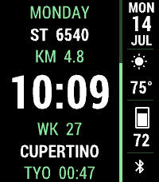
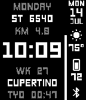
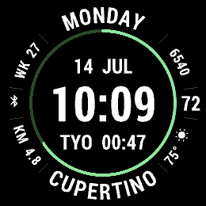

# CobbleStyle 2

A highly configurable watchface for Pebble smartwatches. Time (analog, digital, or
big‑digit), weather, activity, and a stack of optional info widgets are rendered with
crisp anti‑aliased vector graphics (via [FCTX](https://github.com/jrmobley/pebble-fctx))
and laid out proportionally so the design scales cleanly across every Pebble display —
from the 144×168 classics to the 200×228 Emery and the 260×260 round Gabbro.

| Emery (200×228, color) | Flint (144×168, B&W) | Gabbro (260×260, round) |
|:---:|:---:|:---:|
|  |  |  |

## Supported platforms

Builds and renders on **all seven** Pebble/RePebble platforms:

| Platform | Device | Resolution | Display | Health |
|----------|--------|-----------|---------|:------:|
| aplite   | Pebble Classic       | 144×168 | B&W   | – |
| basalt   | Pebble Time          | 144×168 | color | ✓ |
| chalk    | Pebble Time Round    | 180×180 | color, round | ✓ |
| diorite  | Pebble 2             | 144×168 | B&W   | ✓ |
| emery    | Pebble Time 2        | 200×228 | color | ✓ |
| flint    | Pebble 2 Duo         | 144×168 | B&W   | ✓ |
| gabbro   | Pebble Round 2       | 260×260 | color, round | ✓ |

## Features

- **Three time modes** — Analog, Digital, and Big Time (full‑screen hours/minutes),
  with an optional second hand and a configurable hours/minutes separator.
- **Weather** — current temperature and a condition icon, plus your city name.
  Powered by [Open‑Meteo](https://open-meteo.com/) (no API key required) with reverse
  geocoding via [OpenStreetMap Nominatim](https://nominatim.org/). Automatic (GPS) or
  manual coordinates; °F / °C / K; configurable refresh interval.
- **Activity** (health‑capable platforms) — a graphical step‑goal ring/bar plus widgets
  for step count, distance (m / km / mi), active time, resting/active calories, and
  heart rate where the sensor exists.
- **Info widgets** — mix and match: local time, second time zone, date, day of week,
  week number, AM/PM, seconds, location, and custom text. Rectangular faces expose a
  6‑slot sidebar (left/right); round faces arrange widgets radially around the dial.
- **Theming** — on color displays, pick a preset theme or set primary / secondary /
  background / icon colors individually; B&W displays render in high‑contrast
  monochrome.
- **Localization** — UI day/month/label strings in Català, Magyar, Nederlands, Norsk,
  and Svenska, or follow the system language.
- **Nice‑to‑haves** — Bluetooth‑disconnect vibration alerts and backlight‑while‑charging.

### Battery‑conscious by design

- The tick service runs at **minute** resolution and only escalates to **per‑second**
  while a seconds widget or the analog second hand is actually on screen.
- The heart‑rate sensor is only sampled while a **Heart Rate** widget is displayed;
  otherwise it stays off.

## Configuration

Settings are exposed through a [Clay](https://github.com/pebble/clay) configuration page
(open it from the Pebble app). A custom Clay extension provides the alternate‑timezone
picker and a “look up coordinates from a place name” helper for manual weather locations.

## Building

Requires the Pebble SDK / [pebble tool](https://github.com/coredevices/pebble-tool).

```bash
npm install          # fetch JS/C dependencies
pebble build         # builds a .pbw for all target platforms
```

The resulting `.pbw` bundle is written to the `build/` directory.

### Testing in the emulator

```bash
pebble install --emulator emery      # or basalt / chalk / diorite / flint / gabbro / aplite
pebble screenshot --emulator emery
pebble logs --emulator emery
```

## Project layout

```
src/c/
  main.c              init/teardown, time & battery ticks, AppMessage, weather state
  rect.c              rendering for rectangular displays (sidebar layout)
  round.c             rendering for round displays (radial layout)
  common.c / .h       FCTX text helpers, UTF‑8 upper‑casing, shared constants
  pebble-localize.*   vendored localization runtime (loads loc_*.bin dictionaries)
  hash.h              compile‑time DJB2 hashing for localization keys
src/pkjs/
  app.js              PebbleKit JS entry: Clay + self‑contained weather fetch
  config.js           Clay configuration schema
  custom-clay.js      Clay extension (timezone picker, coordinate lookup)
resources/            vector fonts (.ffont), weather/bluetooth icons (.fpath),
                      localization dictionaries (.bin), menu icon
appstore/             marketing screenshots and animated showcases
```

## Dependencies

- [`@rebble/clay`](https://www.npmjs.com/package/@rebble/clay) — settings UI
- [`pebble-fctx`](https://www.npmjs.com/package/pebble-fctx) — vector text/path rendering
- [`pebble-events`](https://www.npmjs.com/package/pebble-events) — multiplexed service subscriptions
- [`pebble-simple-health`](https://www.npmjs.com/package/pebble-simple-health) — health metrics

Weather (Open‑Meteo + Nominatim) and localization are implemented in‑project, so the
face has no binary‑only dependencies and builds for every platform.
~~~~
