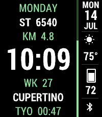
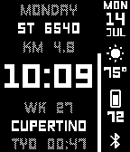
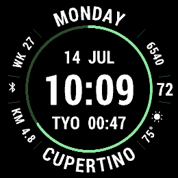

# CobbleStyle 2

A highly configurable watchface for Pebble smartwatches. Time (analog, digital, or
big‑digit), weather, activity, and a stack of optional info widgets are rendered with
crisp anti‑aliased vector graphics (via [FCTX](https://github.com/jrmobley/pebble-fctx))
and laid out proportionally so the design scales cleanly across every Pebble display —
from the 144×168 classics to the 200×228 Emery and the 260×260 round Gabbro.

| Emery (200×228, color) | Flint (144×168, B&W) | Gabbro (260×260, round) |
|:---:|:---:|:---:|
|  |  |  |

## Supported platforms

Builds and renders on **all seven** Pebble/RePebble platforms:

| Platform | Device | Resolution | Display | Health |
|----------|--------|-----------|---------|:------:|
| aplite   | Pebble Classic       | 144×168 | B&W   | – |
| basalt   | Pebble Time          | 144×168 | color | ✓ |
| chalk    | Pebble Time Round    | 180×180 | color, round | ✓ |
| diorite  | Pebble 2             | 144×168 | B&W   | ✓ |
| emery    | Pebble Time 2        | 200×228 | color | ✓ |
| flint    | Pebble 2 Duo         | 144×168 | B&W   | ✓ |
| gabbro   | Pebble Round 2       | 260×260 | color, round | ✓ |

On **aplite** the widget lines are fixed: a "CSTYLE 2" label and the location name.
There are no widget, language or Quiet Time options, because Pebble Classic firmware
lacks the Health and Quiet Time APIs and apps have far less memory there.

## Features

- **Three time modes** — Analog, Digital, and Big Time (full‑screen hours/minutes),
  with an optional second hand and a configurable hours/minutes separator.
- **Weather** — current temperature and a condition icon, plus your city name.
  Powered by [Open‑Meteo](https://open-meteo.com/) (no API key required) with reverse
  geocoding via [OpenStreetMap Nominatim](https://nominatim.org/). Automatic (GPS) or
  manual coordinates; °F / °C / K; configurable refresh interval.
- **Activity** (health‑capable platforms) — a graphical step‑goal ring/bar (with an
  optional custom step goal) plus widgets for step count, distance (m / km / mi),
  active time, time slept, resting/active calories, and heart rate where the sensor
  exists (rectangular faces).
- **Info widgets** — mix and match: local time, second time zone, day and month, day
  of week, week number, AM/PM, seconds, 12H/24H, weather, location, custom text, and a
  **Quiet Time indicator** (see below).
  - *Rectangular faces:* six widget lines above and below the time. The sidebar with
    date, weather, battery and Bluetooth status can sit on the left or the right.
  - *Round faces:* up to ten widgets. Six sit around the dial, with text that follows
    the curve. Two sit inside the ring above and below the time, and two sit beside the
    hours in Big Time mode.
- **Quiet Time indicator** — a widget option that shows a bell while notifications are
  on and a crossed‑out bell while Quiet Time is active. The icons are glyphs in the
  watchface's own font, so they need no translation, and they're sized and colored like
  any other widget text. Available in the widget slots that offer AM/PM and Seconds.
- **Status at a glance** — battery level (icon and percentage) and a Bluetooth
  connected/disconnected icon.
- **Theming** — on color displays, pick a preset theme or set primary / secondary /
  background / icon colors individually; B&W displays render in high‑contrast
  monochrome.
- **Localization** — UI day/month/label strings in Català, Magyar, Nederlands, Norsk,
  and Svenska, or follow the system language.
- **Nice‑to‑haves** — Bluetooth‑disconnect vibration alerts (silent, weak, normal,
  strong or double) and backlight‑while‑charging.

### Battery‑conscious by design

- The tick service runs at **minute** resolution and only escalates to **per‑second**
  while a seconds widget or the analog second hand is actually on screen.
- The heart‑rate sensor is only sampled while a **Heart Rate** widget is displayed;
  otherwise it stays off.
- There is no system event for Quiet Time changes, so its state is checked on the
  existing tick and the face redraws only when it changes. This adds no extra wake‑ups.

## Configuration

Settings are exposed through a [Clay](https://github.com/pebble/clay) configuration page
(open it from the Pebble app). A custom Clay extension provides the alternate‑timezone
picker and a “look up coordinates from a place name” helper for manual weather locations.

## Building

Requires the Pebble SDK / [pebble tool](https://github.com/coredevices/pebble-tool).

```bash
npm install          # fetch JS/C dependencies
pebble build         # builds a .pbw for all target platforms
```

The resulting `.pbw` bundle is written to the `build/` directory.

### Testing in the emulator

```bash
pebble install --emulator emery      # or basalt / chalk / diorite / flint / gabbro / aplite
pebble screenshot --emulator emery
pebble logs --emulator emery
```

Settings can be pushed without the phone‑side config page by sending the numeric
message keys (listed in `build/js/message_keys.json` after a build) as strings, e.g.
`pebble send-app-message --emulator emery --string <KEY>=<VALUE>`.

The emulator firmware has no Settings app, so Quiet Time can't be turned on there; the
Quiet Time indicator always shows its "notifications on" state in the emulator.

## Project layout

```
src/c/
  main.c              init/teardown, time & battery ticks, AppMessage, weather state
  rect.c              rendering for rectangular displays (sidebar layout)
  round.c             rendering for round displays (radial layout)
  common.c / .h       FCTX text helpers, UTF‑8 upper‑casing, shared constants
  pebble-localize.*   vendored localization runtime (loads loc_*.bin dictionaries)
  hash.h              compile‑time DJB2 hashing for localization keys
src/pkjs/
  app.js              PebbleKit JS entry: Clay + self‑contained weather fetch
  config.js           Clay configuration schema
  custom-clay.js      Clay extension (timezone picker, coordinate lookup)
resources/            vector fonts (.ffont), weather/bluetooth icons (.fpath),
                      localization dictionaries (.bin), menu icon
tools/glyphs/         scripts that add the Quiet Time bell glyphs to the fonts
appstore/             marketing screenshots and animated showcases
```

### Custom font glyphs

The Roboto Condensed `.ffont` files (pebble‑fctx 1.6.x format) carry two extra glyphs
for the Quiet Time indicator: a bell at code point `0x02` and a crossed‑out bell at
`0x03`. Control‑code slots are used because the face's text pipeline only passes
single‑byte characters (plus a `0x01` escape for U+01xx). The aplite fonts don't have
them.

The shapes are defined in `tools/glyphs/bellglyph.py`. To change them, edit that file
and re‑apply; the script replaces its own glyphs and leaves every other character
untouched:

```bash
python3 tools/glyphs/add_bell_glyphs.py \
  resources/data/RobotoCondensed-{Bold,Regular}{,~diorite,~flint}.ffont
```

If a font grows, raise `FONT_BUFFER_SIZE` in `src/c/common.h` to at least the largest
`.ffont` loaded on each platform.

## Dependencies

- [`@rebble/clay`](https://www.npmjs.com/package/@rebble/clay) — settings UI
- [`pebble-fctx`](https://www.npmjs.com/package/pebble-fctx) — vector text/path rendering
- [`pebble-events`](https://www.npmjs.com/package/pebble-events) — multiplexed service subscriptions
- [`pebble-simple-health`](https://www.npmjs.com/package/pebble-simple-health) — health metrics

Weather (Open‑Meteo + Nominatim) and localization are implemented in‑project, so the
face has no binary‑only dependencies and builds for every platform.
